# 16 — Project Graphify

This document is the canonical **end-to-end graph view** of `Adalatai_ground_zero`. It is designed for any assistant — Claude, Codex, Copilot, or a human developer — to understand the full system at a glance and quickly navigate backend, frontend, data flow, and integration points.

## Why this exists

- Captures the full project graph in one place
- Maps major code layers, app boundaries, and runtime flows
- Includes exact file locations for backend and frontend
- Helps AI assistants answer questions without scanning the entire repo

## System graph

```mermaid
flowchart TB
  subgraph Browser
    user[User Browser / Client]
  end

  subgraph Frontend[Active Frontend]
    frontend[React SPA]
    apiClient[`mamlaAI_ground_zero/frontend/src/services/api.js`]
    appContent[`mamlaAI_ground_zero/frontend/src/AppContent.js`]
    store[`mamlaAI_ground_zero/frontend/src/store.js`]
    slices[`features/userSlice.js, entitlementsSlice.js, chatDocsSlice.js`]
  end

  subgraph Backend[Backend Django API `Legalv1/`]
    core[`Legalv1/core/`]
    users[`Legalv1/users/`]
    aiDraft[`Legalv1/ai_draft/`]
    createDrafts[`Legalv1/create_drafts/`]
    cases[`Legalv1/cases/`]
    calendar[`Legalv1/calendar_management/`]
    talkdoc[`Legalv1/talkdoc/`]
    mamlaBrain[`Legalv1/mamla_brain/`]
    ecourtsScraper[`Legalv1/ecourts_scraper/`]
    ecourtScrapped[`Legalv1/ecourt_scrapped/`]
    todaysUpdates[`Legalv1/todaysupdates/`]
    utilities[`Legalv1/utilities/`]
    searchFacility[`Legalv1/search_facility/`]
    whatsapp[`Legalv1/whatsapp_module/`]
    calenderSetup[`Legalv1/calendersetup/`]
  end

  subgraph Infra[Infrastructure]
    supabase[Supabase Auth]
    mongo[MongoDB]
    redis[Redis / Celery broker / cache]
    opensearch[OpenSearch]
    llm[LLM Providers: OpenAI / OpenRouter]
    celery[Celery workers]
    fastapi[FastAPI scraper service] 
  end

  user --> frontend
  frontend --> appContent
  frontend --> apiClient
  apiClient --> backend

  backend --> supabase
  backend --> mongo
  backend --> redis
  backend --> opensearch
  backend --> llm
  backend --> celery
  ecourtScrapped --> fastapi
  ecourtsScraper --> fastapi

  backend --> core
  backend --> users
  backend --> aiDraft
  backend --> createDrafts
  backend --> cases
  backend --> calendar
  backend --> talkdoc
  backend --> mamlaBrain
  backend --> ecourtsScraper
  backend --> ecourtScrapped
  backend --> todaysUpdates
  backend --> utilities
  backend --> searchFacility
  backend --> whatsapp
  backend --> calenderSetup

  legacy[`Legacy frontend reference\nfrontend_webpack/`] --> backend
  frontend --- legacy
```

> Note: the active frontend is `mamlaAI_ground_zero/frontend/`. `frontend_webpack/` remains in the repo only as a legacy reference and is not the current production UI.

## Core architecture summary

### Active frontend

- Entry: `mamlaAI_ground_zero/frontend/src/index.js`
- Router / auth guard: `mamlaAI_ground_zero/frontend/src/AppContent.js`
- Redux store: `mamlaAI_ground_zero/frontend/src/store.js`
- API client: `mamlaAI_ground_zero/frontend/src/services/api.js`
- Protected routes: `/home`, `/cases`, `/clients`, `/drafting`, `/ecourts`, `/calendar`, `/todays-updates`
- Key page components:
  - Case registry: `components/cases/CaseRegistry.jsx`
  - Case hub: `components/cases/CaseHub.jsx`
  - Guided drafting: `components/drafting/GuidedDraftingPage.jsx`
  - Document RAG: `components/documents/DocumentWorkspace.jsx`
  - eCourts shell and terminal screens: `components/ecourt_scrapper/`

### Backend Django project

- Settings and URLs: `Legalv1/Legalv1/settings.py`, `Legalv1/Legalv1/urls.py`
- Shared clients: `Legalv1/core/init_clients.py`
- Auth decorator: `Legalv1/supabase_required.py`
- LLM wrapper: `Legalv1/core/llm_client.py`
- Health check: `Legalv1/core/views.py`

### Main backend apps

- `users/`: Supabase login, signup, onboarding, profile, feedback, client linking
- `ai_draft/`: AI draft sessions, section management, save/load, guided intake
- `create_drafts/`: Template-based drafts, draft content storage, PDF export
- `cases/`: Case registry, hearings, notes, tasks, case closure workflows
- `calendar_management/`: Legal calendar events, recurring series, conflict checking
- `talkdoc/`: RAG document chat, upload + indexing, document session management
- `mamla_brain/`: Domain reasoning framework, API-key auth, tiered LLM routing, knowledge retrieval
- `ecourts_scraper/`: Active scraper-first eCourts runtime, Mongo cache, scraper jobs
- `ecourt_scrapped/`: Django proxy for eCourts v2 FastAPI dropdown/case/order APIs
- `todaysupdates/`: Court subscription feed and update dispatch
- `utilities/`: Email, state/district/court lookup, shared helper endpoints
- `search_facility/`: OpenSearch-backed document search
- `whatsapp_module/`: WhatsApp webhook integration
- `calendersetup/`: Google Calendar OAuth integration

### Data stores and external systems

- MongoDB: primary persistent storage for application data and caches
- Redis: Django cache, Celery broker, async worker coordination
- OpenSearch: document search and knowledge retrieval indexes
- Supabase: authentication and user session validation
- LLM providers: OpenAI / OpenRouter called via `Legalv1/core/llm_client.py`
- FastAPI scraper service: proxied by `Legalv1/ecourt_scrapped/` for eCourts terminal v2

## API surface

The frontend uses the backend via `/api/` paths. The key prefixes are:

- `/api/users/` → auth, profile, signup, client onboarding
- `/api/aidrafts/` → AI draft sessions and sections
- `/api/drafts/` → template drafts
- `/api/cases/` → case registry, hearings, notes, tasks
- `/api/calendar/` → legal calendar events
- `/api/talkdoc/` → document chat / TalkDoc
- `/api/brain/` → Mamla Brain reasoning endpoints
- `/api/ecourts/` → active eCourts scraper runtime
- `/api/ecourts/v2/` → eCourts v2 proxy to the FastAPI scraper
- `/api/todaysupdates/` → court updates subscription
- `/api/search/` → search facility
- `/api/webhook/` → WhatsApp webhook
- `/api/utils/` → utility endpoints

For exact endpoint details, use `docs/04-api-reference.md`.

## End-to-end flows

### Login and protected route flow

1. Browser loads protected page.
2. `AppContent.js` checks token and calls `GET /api/users/check-auth/`.
3. Backend `users/supabase_views.py` validates via Supabase.
4. On success, frontend stores user state in Redux and shows the requested page.
5. On failure, frontend redirects to `/login`.

### AI drafting flow

1. User selects draft or guided drafting page.
2. Frontend sends request to `/api/aidrafts/` or `/api/drafts/`.
3. Backend uses `Legalv1/core/llm_client.py` to call the configured LLM provider.
4. Draft text and metadata are stored in Mongo collections such as `aidrafts_complete_data`, `draft_content_data`, or `user_draft_data`.

### TalkDoc / RAG flow

1. User uploads documents in `DocumentWorkspace.jsx`.
2. Frontend posts uploads to `/api/talkdoc/upload/` and uses `talkdoc` session endpoints.
3. Backend indexes content in Mongo/OpenSearch and calls `llm_client.chat_complete()` as needed.
4. Responses are returned to the frontend chat UI.

### eCourts flow

- Active runtime: `/api/ecourts/` handled by `Legalv1/ecourts_scraper/`.
- v2 proxy: `/api/ecourts/v2/` handled by `Legalv1/ecourt_scrapped/` and forwarded to the external FastAPI scraper.
- The frontend `components/ecourt_scrapper/` screens consume these endpoints and render terminal search / case detail flows.

## Where to look for code

### Frontend code starting points

- `mamlaAI_ground_zero/frontend/src/index.js`
- `mamlaAI_ground_zero/frontend/src/App.js`
- `mamlaAI_ground_zero/frontend/src/AppContent.js`
- `mamlaAI_ground_zero/frontend/src/services/api.js`
- `mamlaAI_ground_zero/frontend/src/store.js`
- `mamlaAI_ground_zero/frontend/src/features/userSlice.js`
- `mamlaAI_ground_zero/frontend/src/components/cases/CaseHub.jsx`
- `mamlaAI_ground_zero/frontend/src/components/drafting/GuidedDraftingPage.jsx`
- `mamlaAI_ground_zero/frontend/src/components/documents/DocumentWorkspace.jsx`
- `mamlaAI_ground_zero/frontend/src/components/ecourt_scrapper/`

### Backend code starting points

- `Legalv1/Legalv1/urls.py`
- `Legalv1/Legalv1/settings.py`
- `Legalv1/core/init_clients.py`
- `Legalv1/core/llm_client.py`
- `Legalv1/supabase_required.py`
- `Legalv1/users/urls.py`
- `Legalv1/ai_draft/urls.py`
- `Legalv1/cases/urls.py`
- `Legalv1/talkdoc/urls.py`
- `Legalv1/ecourts_scraper/urls.py`
- `Legalv1/ecourt_scrapped/urls.py`

## How to use this graphify

- For any assistant: use this document first when asked to explain or modify the project.
- Follow the graph from the browser through frontend routes, then through the backend app boundary to the database and external services.
- Use the exact file paths in this doc to jump straight to implementation points.
- If a flow is in question, refer to the matching section above: Login, AI Drafting, TalkDoc, eCourts.

## Update note

This file is intentionally written as a top-level project graph. It is the go-to source for end-to-end repo understanding, and it should be updated when the active frontend, API prefixes, or backend app boundaries change.
